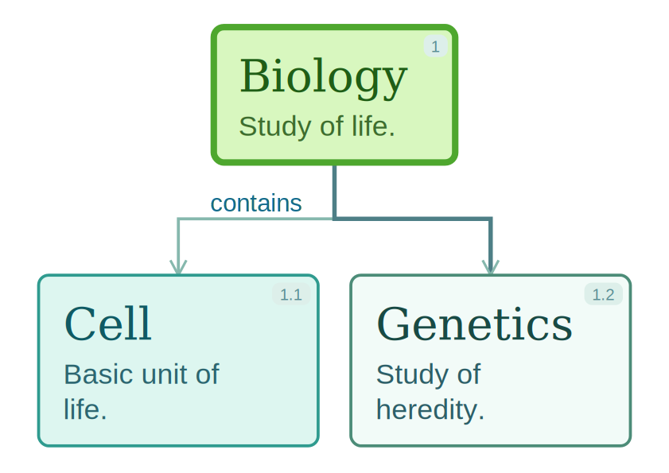
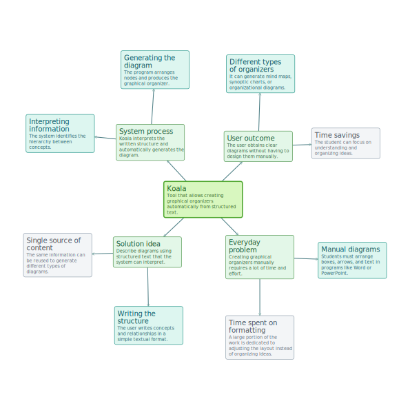

# Koala

Koala is a DSL for generating diagrams from structured text.

Write once, render in multiple layouts.

## Quick Example

Write this:

```text
@theme jungle

main:: 1 Biology
Study of life.

hl:: contains -> 1.1 Cell
Basic unit of life.

1.2 Genetics
Study of heredity.
````

Then run:

```bash
koala compile example.txt --layout tree
```
## Result



---

## Installation

Install from PyPI:

```bash
pip install koala-diagrams==1.0.0
```

Or with pipx:

```bash
pipx install koala-diagrams==1.0.0
```

---

## Usage

### CLI

```bash
koala compile docs/examples/tree.txt --layout tree
koala compile docs/examples/radial.txt --layout radial --theme jungle --size square
koala inspect docs/examples/tree.txt
koala validate docs/examples/radial.txt --strict
```

### Python

```python
import koala

result = koala.compile(
    "docs/examples/radial.txt",
    layout="radial",
    theme="academic",
    size="square",
)

print(result.output_svg)
```

---

## DSL Syntax

Koala uses a simple line-based DSL:

```text
[kind::] [relation ->] number title
```

Example:

```text
1 Main Concept
contains -> 1.1 Child Node
hl:: 1.2 Highlighted Node
```

👉 Full syntax guide:

* docs/syntax.md

👉 Authoring tutorial:

* docs/tutorial.md

👉 Examples:

* docs/examples/

---

## Features

* Simple hierarchical DSL
* Multiple layouts (`tree`, `radial`, `synoptic`)
* Theme system
* CLI and Python API
* SVG output

---

## Philosophy

Koala is built around a simple idea:

The same source file should be able to drive multiple layouts and visual styles without rewriting the content.

---

## License

MIT


---
´´´
## Multiple Layouts

Tree, radial, and synoptic layouts from the same source.

`
´´´
